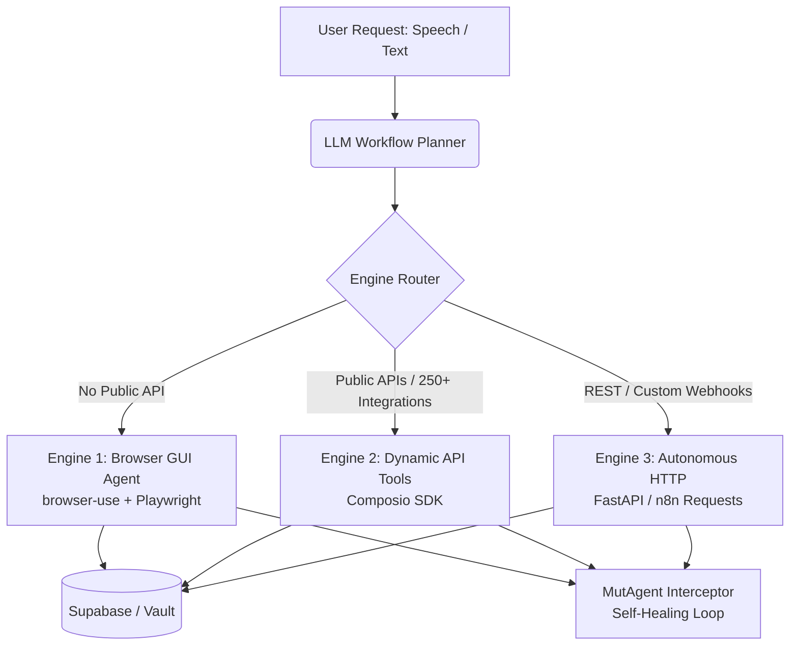

# 🤖 VoxAgent AI — Triple-Engine Hybrid Automation Platform

[](https://fastapi.tiangolo.com/)
[](https://react.dev/)
[](https://vite.dev/)
[](https://tailwindcss.com/)
[](https://supabase.com/)
[](https://github.com/mutagent)

**VoxAgent AI** is a state-of-the-art automation framework that converts casual speech or plain-text instructions into fully executed, self-healing digital workflows across any web application or third-party service.

> **Hackathon Team Identity:** Team NxtGen — `[hackindia-team:hackindia-spark-11-hyderabad-telangana-south-central-region:nxtgen]`

---

## 📖 Table of Contents
1. [Core Vision & Architecture](#-core-vision--architecture)
2. [Project Directory Structure](#%EF%B8%8F-project-directory-structure)
3. [MutAgent Self-Healing Integration](#-mutagent-self-healing-integration)
4. [Database DDL Setup (Supabase)](#-database-ddl-setup-supabase)
5. [Quick-Start Installation Guide](#-quick-start-installation-guide)
    - [Prerequisites](#prerequisites)
    - [Backend Setup](#1-backend-setup)
    - [Frontend Setup](#2-frontend-setup)
6. [Development Workflow & Commands](#%EF%B8%8F-development-workflow--commands)

---

## 🔮 Core Vision & Architecture

VoxAgent AI uses a **Triple-Engine Hybrid Automation Architecture** to execute tasks across any software layer seamlessly:



*   **Engine 1 (Browser GUI Agent):** Powered by `browser-use` and `Playwright` to automate sites lacking APIs (e.g., college ERPs, legacy web apps, Instagram, Canva, WhatsApp Web).
*   **Engine 2 (Dynamic API Tools):** Uses the `Composio SDK` to connect to 250+ tools (e.g., Google Workspace, Slack, Notion, GitHub).
*   **Engine 3 (Autonomous HTTP):** Dynamically invokes custom webhooks and REST endpoints.

---

## 🗺️ Project Directory Structure

```text
├── README.md                 # Root documentation (this file)
├── AGENTS.md                 # Helix orchestrator agent definitions
├── CLAUDE.md                 # Dev instructions and local commands
├── LICENSE                   # Open-source license file
├── PROJECT_CONTEXT.md        # Technical architecture context
├── backend/                  # FastAPI service (Python 3.10+)
│   ├── app/                  # Main server logic, schemas, and routers
│   │   ├── services/         # Orchestration & Integration engines
│   │   └── services/mutagent/# MutAgent Self-Healing engine
│   ├── main.py               # Backend entry point
│   ├── requirements.txt      # Python dependencies
│   └── .env.example          # Environment variables template
└── frontend/                 # React application (Vite + Tailwind CSS)
    ├── src/                  # React components, pages, and hooks
    ├── package.json          # Node dependencies & scripts
    └── .env.example          # Frontend configuration template
```

---

## 🛡️ MutAgent Integration & Optimization (Helix ADL)

VoxAgent AI is built and optimized using the **MutAgent Helix** framework, integrating both a developer-time Agent Development Lifecycle (ADL) optimization loop and a runtime self-healing engine.

### 🔄 MutAgent Helix ADL Optimization Loop (NxtGen Submission)

Team NxtGen has reverse-derived and validated the **VoxAgent Prompt-to-Blueprint Planner** using MutAgent Helix. The full lifecycle loop conducted is:

```
*spec  → *build → *evaluate → *diagnose → *optimize (repeated 5x) → package
```

1. **`*spec` (`agentspec.yaml`)**: Establishes 9 binary evaluation criteria, 8 scenario types, and formalizes constraints on route classification, disambiguation gates, data-handoff placeholder wiring, reactive triggers, and fan-out batching.
2. **`*build` (`verify_build_alignment.py`)**: Runs 13 AST-based structural checks to verify prompt fidelity and model constraints at build-time.
3. **`*evaluate` (`run_dataset_through_planner.py`)**: Leverages a 24-item adversarial evaluation dataset covering complex ambiguity, schema traps, and multi-step handoffs.
4. **`*diagnose`**: Identifies root causes of planner failures with exact code/system prompt citations.
5. **`*optimize`**: Amends system prompt instructions through a bounded, gated loop.

#### 📈 Scorecard & Defect Optimization Results

The primary target metric—preventing the planner from inventing values for omitted required parameters (`no-guessed-required-param`)—was optimized from **38% to 100% pass rate** on the 24-trace adversarial dataset.

| # | Defect Identified & Fixed | Severity | Fix Details | Commit |
|---|---|---|---|---|
| 1 | **Credential Leak Path**: Planner asked for raw credentials (`username`/`password`) which VoxAgent resolves out-of-band via encrypted App Vault. | **High** | Rule 7 added: credential tasks must be out-of-band and never parameters. | `69d238f` |
| 2 | **Invented-value Contradiction**: Planner listed a parameter in `missing_parameters` but still wrote a fabricated literal in `parameters`. | **Medium** | Rule 2 amended: flagged missing keys must be completely absent from step parameters. | `69d238f` |
| 3 | **Fan-out Over-flagging**: Planner incorrectly marked named batch/Airtable variables as missing. | **Medium** | Rule 5 amended with concrete literal carve-outs and examples. | `71fb7b1` |
| 4 | **Generalization Gap**: Fixed Rule 2 failed to generalize outside Airtable/fan-out scenarios. | **Medium** | Rule 2 given a second worked example and strict pre-emit consistency checks. | `28320b1` |

#### 🧪 Reproducing the Eval Suite
To reproduce Team NxtGen's MutAgent Helix evaluation and scorecard runs:
```bash
# Activate the virtual environment
cd backend && source .venv/bin/activate

# Re-run the 24-item dataset through the planner
python3 ../.mutagent/specs/voxagent-planner/run_dataset_through_planner.py

# Run the alignment and evaluation scorecard checks
cd ../.mutagent/specs/voxagent-planner
python3 tier0_code_checks.py
python3 aggregate_scorecard_final.py
```

---

### 🤖 Runtime Self-Healing Engine

At runtime, VoxAgent AI utilizes **MutAgent** to intercept action dispatcher exceptions and dynamically heal workflows:

1. **Phase 1 (Failure Classification):** Evaluates exceptions using `FailureClass` (e.g. `TRANSIENT`, `SCHEMA_MISMATCH`, `SELECTOR_DRIFT`).
2. **Phase 2 (Retry-with-Backoff):** Automates retries with exponential backoff and jitter.
3. **Phase 3 (Mutation Memory):** Persists successful manual fixes in the `mutation_memory` table to bypass future failures.
4. **Phase 4 (LLM Repair):** Uses an independent Groq (`llama-3.3-70b-versatile`) model to repair input parameters and selectors.
5. **Phase 7 (Circuit Breaker):** Trips after 5 consecutive errors, bypassing retries and escalating directly to the user to save token costs.

#### Configuration Variables (`backend/.env`)
```ini
MUTAGENT_ENABLED=true
MUTAGENT_MAX_RETRY_ATTEMPTS=3
MUTAGENT_LLM_REPAIR_ENABLED=true
MUTAGENT_SHADOW_MODE=true  # Logs proposals without executing mutations
MUTAGENT_CIRCUIT_BREAKER_THRESHOLD=5
MUTAGENT_CIRCUIT_BREAKER_COOLDOWN_MINUTES=30
```

---

## 🗄️ Database DDL Setup (Supabase)

To initialize your Supabase PostgreSQL instance, run the following SQL script in your **Supabase SQL Editor**:

```sql
-- Enable the pgvector extension for similarity search
CREATE EXTENSION IF NOT EXISTS vector;

-- 1. Users Table
CREATE TABLE IF NOT EXISTS users (
    id UUID PRIMARY KEY,
    email TEXT,
    created_at TIMESTAMPTZ DEFAULT NOW()
);

-- 2. Agents Table
CREATE TABLE IF NOT EXISTS agents (
    id UUID PRIMARY KEY DEFAULT gen_random_uuid(),
    user_id UUID REFERENCES users(id) ON DELETE CASCADE,
    original_prompt TEXT NOT NULL,
    json_blueprint JSONB NOT NULL,
    trigger_type TEXT NOT NULL, -- 'manual', 'scheduled', 'event_trigger'
    cron_schedule TEXT,
    is_active BOOLEAN DEFAULT TRUE,
    created_at TIMESTAMPTZ DEFAULT NOW(),
    updated_at TIMESTAMPTZ DEFAULT NOW()
);

-- 3. Connected Apps (App Vault) Table
CREATE TABLE IF NOT EXISTS connected_apps (
    id UUID PRIMARY KEY DEFAULT gen_random_uuid(),
    user_id UUID REFERENCES users(id) ON DELETE CASCADE,
    app_name TEXT NOT NULL,
    encrypted_credentials JSONB NOT NULL,
    status TEXT DEFAULT 'active', -- 'active', 'revoked'
    created_at TIMESTAMPTZ DEFAULT NOW(),
    updated_at TIMESTAMPTZ DEFAULT NOW(),
    UNIQUE (user_id, app_name)
);

-- 4. Vault Notes Table
CREATE TABLE IF NOT EXISTS vault_notes (
    id UUID PRIMARY KEY DEFAULT gen_random_uuid(),
    user_id UUID REFERENCES users(id) ON DELETE CASCADE,
    title VARCHAR(255) DEFAULT 'Untitled Note',
    content JSONB NOT NULL,
    created_at TIMESTAMPTZ DEFAULT NOW()
);

-- 5. Execution Logs Table
CREATE TABLE IF NOT EXISTS execution_logs (
    id UUID PRIMARY KEY DEFAULT gen_random_uuid(),
    agent_id UUID REFERENCES agents(id) ON DELETE CASCADE,
    run_id UUID NOT NULL,
    status TEXT NOT NULL,
    log_messages JSONB DEFAULT '[]'::jsonb,
    proof_screenshot_url TEXT,
    executed_at TIMESTAMPTZ DEFAULT NOW()
);

-- 6. Pending Actions (Human-in-the-Loop Pauses) Table
CREATE TABLE IF NOT EXISTS pending_actions (
    id UUID PRIMARY KEY DEFAULT gen_random_uuid(),
    run_id UUID,
    agent_id UUID REFERENCES agents(id) ON DELETE CASCADE,
    user_id UUID REFERENCES users(id) ON DELETE CASCADE,
    step_number INTEGER,
    question TEXT NOT NULL,
    input_type TEXT DEFAULT 'text',
    options JSONB,
    context_snapshot JSONB,
    status TEXT DEFAULT 'pending', -- 'pending', 'resolved'
    resolved_answer TEXT,
    resolved_at TIMESTAMPTZ,
    created_at TIMESTAMPTZ DEFAULT NOW()
);

-- Index enforcing only one open ("pending") action per agent
CREATE UNIQUE INDEX IF NOT EXISTS idx_pending_actions_one_open_per_agent 
ON pending_actions (agent_id) 
WHERE (status = 'pending');

-- 7. MutAgent Mutation Memory Table
CREATE TABLE IF NOT EXISTS mutation_memory (
    id UUID PRIMARY KEY DEFAULT gen_random_uuid(),
    app TEXT NOT NULL,
    action TEXT NOT NULL,
    failure_signature TEXT NOT NULL,
    fix_type TEXT NOT NULL,
    fix_payload JSONB NOT NULL,
    success_count INTEGER DEFAULT 1,
    created_by_llm BOOLEAN DEFAULT FALSE,
    last_used_at TIMESTAMPTZ DEFAULT NOW(),
    created_at TIMESTAMPTZ DEFAULT NOW(),
    UNIQUE (app, action, failure_signature)
);

-- 8. MutAgent Circuit Breakers Table
CREATE TABLE IF NOT EXISTS circuit_breakers (
    id UUID PRIMARY KEY DEFAULT gen_random_uuid(),
    app TEXT NOT NULL,
    action TEXT NOT NULL,
    consecutive_failures INTEGER DEFAULT 0,
    status TEXT DEFAULT 'closed', -- 'closed', 'open'
    opened_at TIMESTAMPTZ,
    cooldown_until TIMESTAMPTZ,
    last_failure_at TIMESTAMPTZ,
    updated_at TIMESTAMPTZ DEFAULT NOW(),
    UNIQUE (app, action)
);

-- 9. Business Knowledge Table (RAG Contexts)
CREATE TABLE IF NOT EXISTS business_knowledge (
    id UUID PRIMARY KEY DEFAULT gen_random_uuid(),
    user_id UUID REFERENCES users(id) ON DELETE CASCADE,
    source_type TEXT NOT NULL,
    source_name TEXT NOT NULL,
    content TEXT NOT NULL,
    embedding VECTOR(768),
    created_at TIMESTAMPTZ DEFAULT NOW()
);

-- 10. Semantic Cache Table (Cache matching intents)
CREATE TABLE IF NOT EXISTS semantic_cache (
    id UUID PRIMARY KEY DEFAULT gen_random_uuid(),
    user_id UUID REFERENCES users(id) ON DELETE CASCADE,
    task_intent TEXT NOT NULL,
    intent_embedding VECTOR(768),
    llm_output TEXT NOT NULL,
    created_at TIMESTAMPTZ DEFAULT NOW()
);

-- 11. RPC: match_business_knowledge
CREATE OR REPLACE FUNCTION match_business_knowledge (
  query_embedding VECTOR(768),
  match_user_id UUID,
  match_threshold FLOAT,
  match_count INT
)
RETURNS TABLE (
  id UUID,
  content TEXT,
  similarity FLOAT
)
LANGUAGE plpgsql
AS $$
BEGIN
  RETURN QUERY
  SELECT
    bk.id,
    bk.content,
    1 - (bk.embedding <=> query_embedding) AS similarity
  FROM business_knowledge bk
  WHERE bk.user_id = match_user_id
    AND 1 - (bk.embedding <=> query_embedding) >= match_threshold
  ORDER BY bk.embedding <=> query_embedding ASC
  LIMIT match_count;
END;
$$;

-- 12. RPC: match_semantic_cache
CREATE OR REPLACE FUNCTION match_semantic_cache (
  query_embedding VECTOR(768),
  match_user_id UUID,
  match_threshold FLOAT
)
RETURNS TABLE (
  id UUID,
  llm_output TEXT,
  similarity FLOAT
)
LANGUAGE plpgsql
AS $$
BEGIN
  RETURN QUERY
  SELECT
    sc.id,
    sc.llm_output,
    1 - (sc.intent_embedding <=> query_embedding) AS similarity
  FROM semantic_cache sc
  WHERE sc.user_id = match_user_id
    AND 1 - (sc.intent_embedding <=> query_embedding) >= match_threshold
  ORDER BY sc.intent_embedding <=> query_embedding ASC
  LIMIT 1;
END;
$$;
```

---

## 🚀 Quick-Start Installation Guide

### Prerequisites
*   [Python 3.10 or higher](https://www.python.org/downloads/)
*   [Node.js v18 or higher](https://nodejs.org/en)
*   A active [Supabase project](https://supabase.com)
*   Required API Keys: Google Gemini, Composio, Groq (Optional, required for LLM repair)

---

### 1. Backend Setup

1.  **Navigate to the backend directory:**
    ```bash
    cd backend
    ```
2.  **Create and activate a virtual environment:**
    ```bash
    python3 -m venv venv
    source venv/bin/activate  # On Windows: venv\Scripts\activate
    ```
3.  **Install dependencies:**
    ```bash
    pip install -r requirements.txt
    ```
4.  **Install Playwright browser binaries (Chromium is required):**
    ```bash
    playwright install chromium
    ```
5.  **Configure environment variables:**
    *   Duplicate `.env.example` as `.env`:
        ```bash
        cp .env.example .env
        ```
    *   Populate your keys:
        ```env
        GEMINI_API_KEY=your_gemini_api_key_here
        SUPABASE_URL=your_supabase_project_url
        SUPABASE_SERVICE_ROLE_KEY=your_supabase_service_role_key
        COMPOSIO_API_KEY=your_composio_api_key
        GROQ_API_KEY=your_groq_api_key  # Required for MutAgent Llama-3.3 repair
        ```
6.  **Run the backend server:**
    ```bash
    uvicorn main:app --reload --port 8000
    ```
    *API documentation will be available locally at [http://localhost:8000/docs](http://localhost:8000/docs).*

---

### 2. Frontend Setup

1.  **Navigate to the frontend directory:**
    ```bash
    cd ../frontend
    ```
2.  **Install npm packages:**
    ```bash
    npm install
    ```
3.  **Configure environment variables:**
    *   Duplicate `.env.example` as `.env`:
        ```bash
        cp .env.example .env
        ```
    *   Ensure it points to the FastAPI local endpoint:
        ```env
        VITE_API_BASE_URL=http://localhost:8000/api/v1
        ```
4.  **Start the Vite development server:**
    ```bash
    npm run dev
    ```
    *The frontend will run at [http://localhost:5173](http://localhost:5173).*

---

## 🛠️ Development Workflow & Commands

| Scope | Command | Description |
| :--- | :--- | :--- |
| **Backend** | `python main.py` | Run local server (equivalent to uvicorn) |
| **Backend** | `pytest` | Execute backend tests |
| **Frontend** | `npm run build` | Build production-ready assets |
| **Frontend** | `npm run lint` | Run Oxlint fast lint checks |
| **Frontend** | `npm run dev` | Start development web server |
